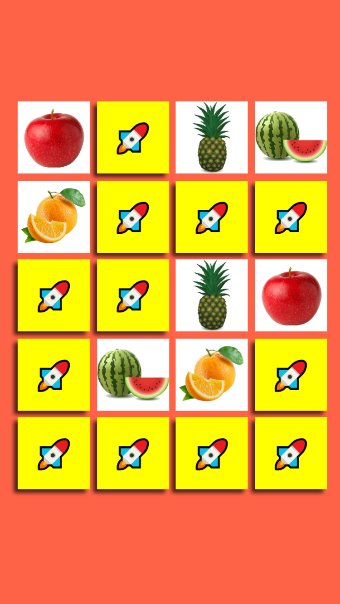

# Fruits-R-Us

This is a ReactJs memory game I built for my two-year-old nephews in my first week of learning ReactJs.

The interface is intuitive:

* Click on the downturned tiles to reveal the fruits on their faces.
* Reveal two matching fruits on successive clicks, and the tiles stay upturned until game ends.
* Reveal two different fruits, and the respective tiles return to their downturned state.
* Game is over when every fruit has been matched.

## Motivation

The boys have started identifying fruits (even fruits they have not yet seen physically) on their play mat. I'm just gamifying the learning process for them.
